# Pertemuan 11

## Profil
| Variable | Isi |
| -------- | --- |
| **Nama** |Faiz Maulana |
| **NIM** | 312310469 |
| **Kelas** | TI.23.A.5 |
| **Mata Kuliah** | Bahasa Pemrograman |

### Latihan
## Ubah kode dibawah ini menjadi fungsi lambda
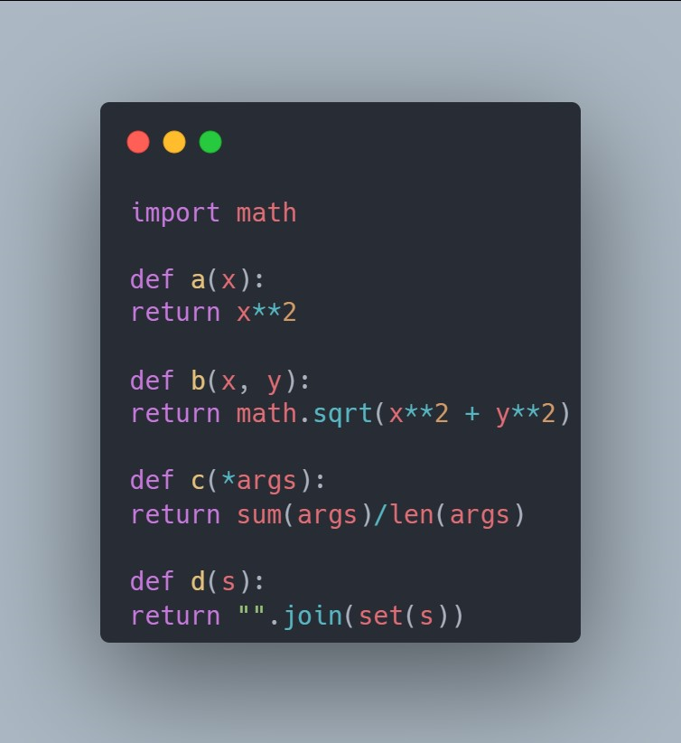

## setelah di ubah
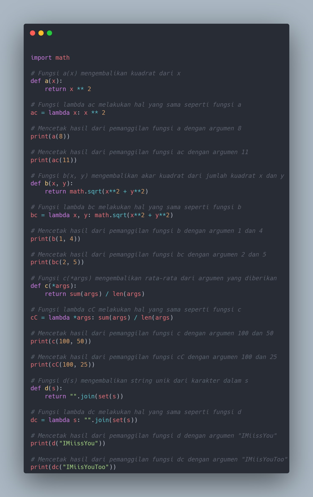

## Outputnya
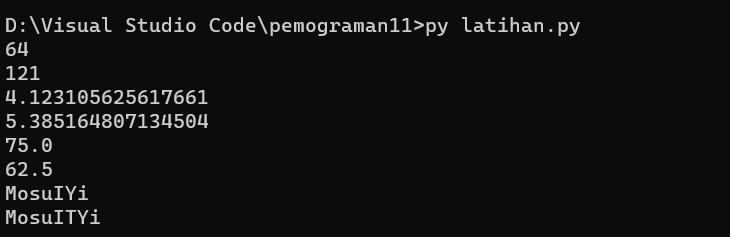

## Tugas Praktikum
_Buat program sederhana dengan mengaplikasikan penggunaan fungsi yang akan menampilkan daftar nilai mahasiswa, dengan ketentuan:_
- Fungsi tambah() untuk menambah data
- Fungsi tapilkan() untuk menampilkan data
- Fungsi hapus(nama) untuk menghapus data berdasarkan nama
- Fungsi ubah(nama) untuk mengubah data berdasarkan nama
- Buat flowchart dan penjelasan programnya pada README.md

# Input program 
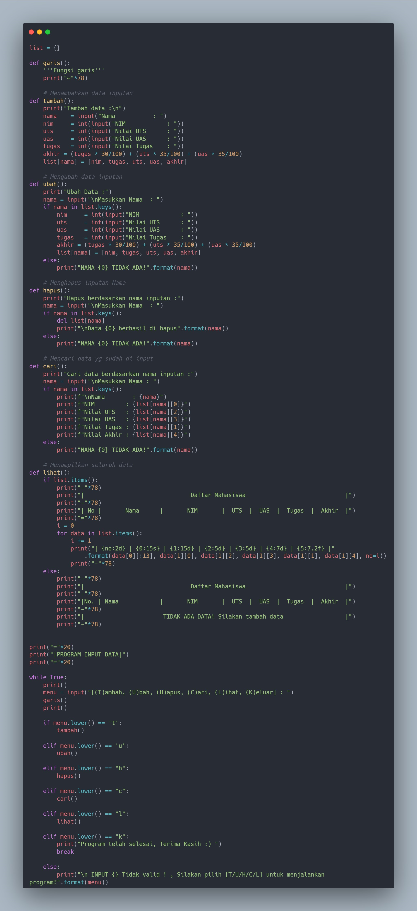

### Penjelasan
- _Pada dasar nya program ini sama seperti di Pertemuan-10, bedanya di program ini di tambahkan `Function` / Sub rutin. 
Seperti program ada di atas `def` yg berati definision, & contoh `def garis()` Untuk membuat fungsi garis yg di panggil dari `print("~"*80)`._

- _Kalau `def tambah()`, `def ubah()`, `def hapus()`, `def cari()`, `def lihat()` di panggil dari program berikut :_

```python
while True: 
    print()
    menu = input("[(T)ambah, (U)bah, (H)apus, (C)ari, (L)ihat, (K)eluar] : ")
    garis("~"*80)
    print()

    if menu.lower() == 't':
        tambah()

    elif menu.lower() == 'u':
        ubah()       

    elif menu.lower() == "h":
        hapus() 

    elif menu.lower() == "c":
        cari()

    elif menu.lower() == "l":
        lihat() 

    elif menu.lower() == "k":
        print("Program telah selesai, Terima Kasih :) ")
        break

    else:
        print("\n INPUT {} Tidak valid ! , Silakan pilih [T/U/H/C/L] untuk menjalankan program!".format(menu))
```

## Outputnya 

### Tambah data
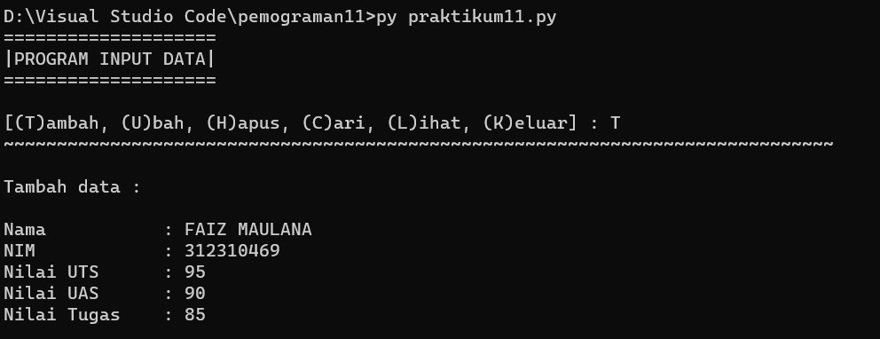

### Ubah data 
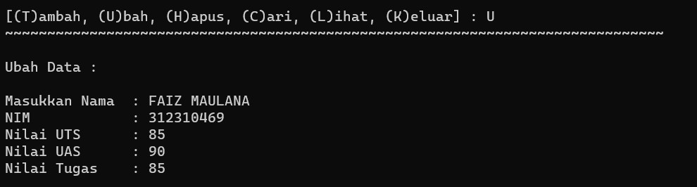

### Cari data
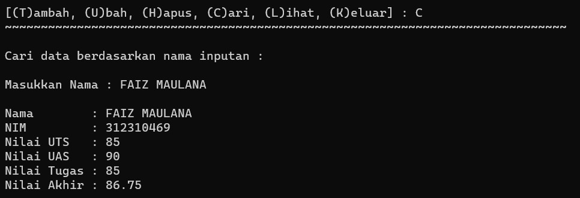

### Lihat data
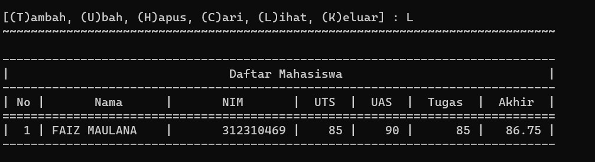

### Hapus data
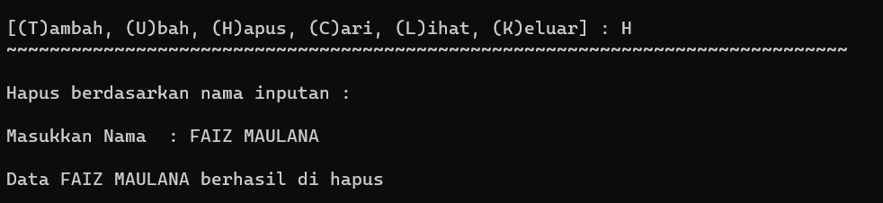

### Keluar
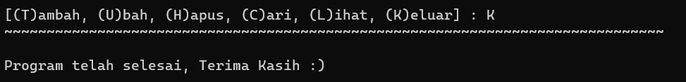

### Flowchart
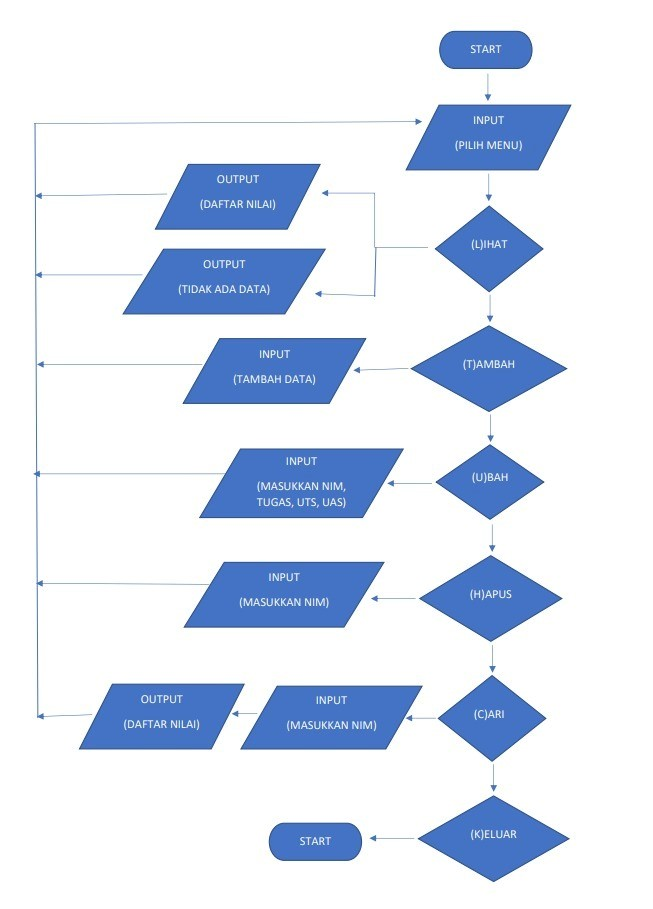

# Terima Kasih
